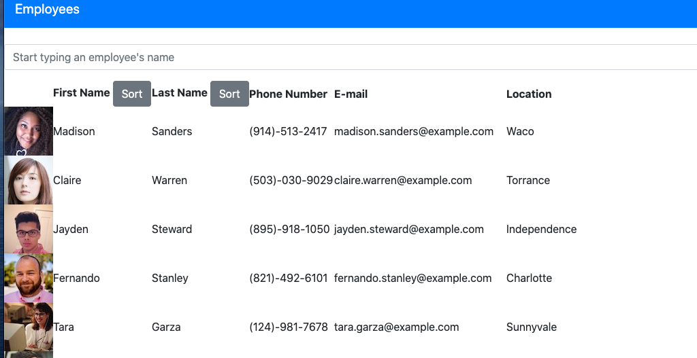
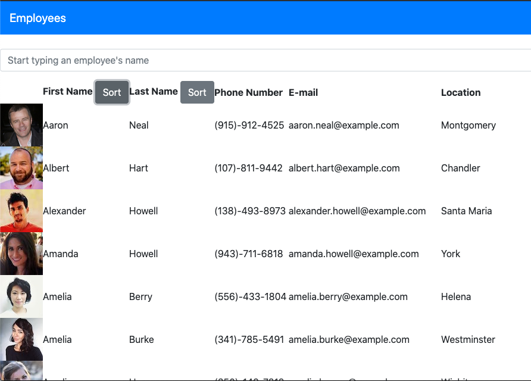
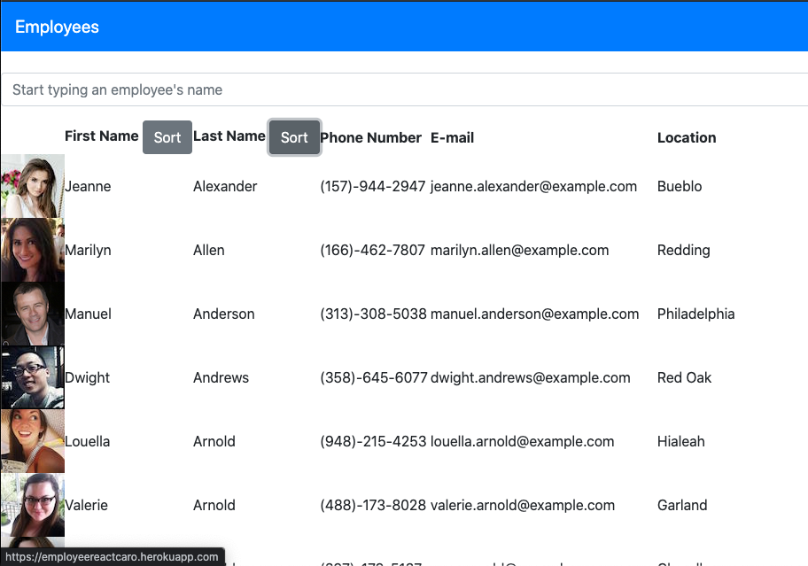
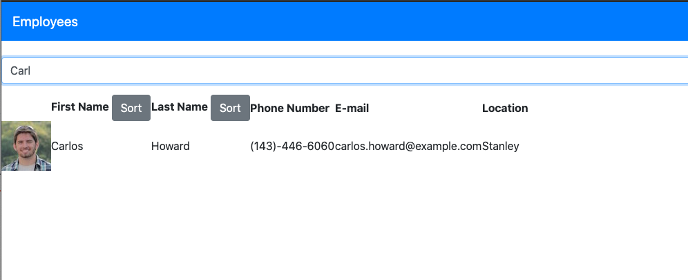

  
# Employee React App

## Table of Contents
* [Description](#description)
* [Installation](#installation)
* [Usage](#usage)
* [License](#license)
* [Contributors](#contributors)
* [Questions](#questions)

## Description
This project uses the React framework to search the random users API and return an array of users. There are various sorts and a search bar to filter through the employees.

## Installation Instructions
One can clone the repo to their local device, and perform an npm i to install the necessary packages. 

Then to run the app, once can run npm start. 

## Usage Information
One can use the app by just visiting the deployed page. https://employeereactcaro.herokuapp.com/

Sort by alphabetical order of the first names by using the sort button over the first names column:

sort by alphabetical order of the last names by using the sort button over the last names column:

search a specific name in the search bar by starting to type:

## License
MIT

## Contributors
Caroline Twyman

## Questions
Contact me:

Github: [https://github.com/carolinetwyman](https://github.com/carolinetwyman)
Email: [carolinetwyman@gmail.com](carolinetwyman@gmail.com)
